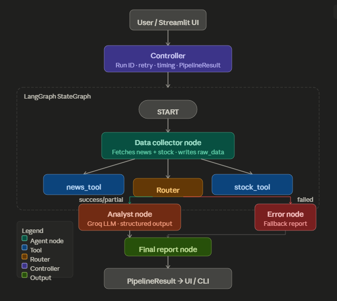

# 🏢 Company Intelligence Agentic System

> A production-grade **Multi-Agent AI System** built with **LangGraph**, **Groq (Llama 3.3 70B)**, and **Streamlit** that autonomously collects, analyzes, and reports on company intelligence using live news and stock data.

[](https://python.org)
[](https://github.com/langchain-ai/langgraph)
[](https://console.groq.com)
[](https://streamlit.io)
[](LICENSE)

---

## 📋 Table of Contents

- [Overview](#-overview)
- [Architecture](#-architecture)
- [Tech Stack](#-tech-stack)
- [Project Structure](#-project-structure)
- [Setup](#-setup)
- [Usage](#-usage)
- [Example Output](#-example-output)
- [Milestones](#-milestones)
- [Configuration](#-configuration)

---

## 🎯 Overview

This system orchestrates **three collaborating AI agents** to produce a complete company intelligence brief:

| Agent | Role | Output |
|---|---|---|
| **Data Collector** | Fetches live news + stock data via APIs | Structured `raw_data` |
| **Analyst** | LLM-powered analysis via Groq | Summary, insights, risks |
| **Orchestrator** | LangGraph `StateGraph` controls flow | Final markdown report |

A **Controller** layer wraps the graph with retry logic, run IDs, timing metrics, and a clean `PipelineResult` envelope consumed by both the CLI and Streamlit UI.

---

## 🏗️ Architecture



### Shared State (`CompanyIntelState`)

```python
# Every agent reads from and writes to this TypedDict
{
  "company":          str,            # Input
  "raw_data":         CollectorOutput, # Written by Collector
  "collector_status": str,            # "success" | "partial" | "failed"
  "analysis":         AnalysisOutput, # Written by Analyst
  "analyst_status":   str,
  "final_report":     str,            # Written by Final Report node
  "pipeline_status":  str,            # "complete" | "failed"
  "error_message":    str | None,
}
```

---

## 🛠️ Tech Stack

| Layer | Technology |
|---|---|
| Agent Framework | LangGraph 0.4 + LangChain 0.3 |
| LLM | Groq — Llama 3.3 70B Versatile (free tier) |
| News Data | NewsAPI (free tier, 100 req/day) |
| Stock Data | Alpha Vantage (free tier, 25 req/day) |
| Structured Output | Pydantic + `with_structured_output()` |
| UI | Streamlit 1.45 |
| Logging | Loguru |
| Config | python-dotenv |

---

## 📦 Project Structure

```
company_intel/
├── agents/
│   ├── state.py            # CompanyIntelState TypedDict (shared memory)
│   ├── data_collector.py   # Agent 1: fetches news + stock
│   └── analyst.py          # Agent 2: Groq LLM analysis
├── tools/
│   ├── base.py             # ToolResult, safe_tool_call, retry_request
│   ├── news_tool.py        # NewsAPI + mock fallback
│   └── stock_tool.py       # Alpha Vantage + mock + ticker resolver
├── graph/
│   └── workflow.py         # LangGraph StateGraph, router, final report
├── app/
│   ├── controller.py       # PipelineResult, retry logic, run ID
│   └── main.py             # CLI entry point
├── config/
│   ├── settings.py         # Centralized config (Groq/OpenAI/mock)
│   ├── llm_factory.py      # build_llm() — provider-agnostic factory
│   └── logger.py           # Loguru console + file logging
├── ui/
│   └── streamlit_app.py    # Dark terminal UI
├── logs/                   # Auto-rotated log files
├── .env                    # Your secrets (never commit)
├── .env.example            # Template for teammates
├── requirements.txt
└── README.md
```

---

## ⚡ Setup

### 1. Clone & create virtual environment

```bash
git clone https://github.com/YOUR_USERNAME/company-intelligence-system.git
cd company-intelligence-system
python -m venv venv

# Windows
venv\Scripts\activate

# macOS / Linux
source venv/bin/activate
```

### 2. Install dependencies

```bash
pip install -r requirements.txt
```

### 3. Configure environment

```bash
cp .env.example .env
```

Open `.env` and fill in your keys:

```bash
# Required — get free key at console.groq.com
GROQ_API_KEY=gsk_xxxxxxxxxxxxxxxxxxxxxxxxxxxx
LLM_PROVIDER=groq
GROQ_MODEL=llama-3.3-70b-versatile

# Optional — enables live news (free at newsapi.org)
NEWS_API_KEY=your_news_api_key

# Optional — enables live stock data (free at alphavantage.co)
ALPHA_VANTAGE_API_KEY=your_alpha_vantage_key

# Development mode — set false when real keys are available
USE_MOCK_DATA=false
```

### 4. Verify config

```bash
python check_config.py
```

Expected output:
```
✅ GROQ_API_KEY  : gsk_abc...xyz (set correctly)
✅ USE_MOCK_DATA : false (LLM calls enabled)
✅ READY — GROQ LLM will be used
```

---

## 🚀 Usage

### Streamlit UI (recommended)

```bash
streamlit run ui/streamlit_app.py
```

Open **http://localhost:8501**, enter a company name, click **Analyze**.

### CLI

```bash
# Analyze a company
python -m app.main --company "Tesla"
python -m app.main --company "Apple Inc"
python -m app.main --company "NVIDIA" --retries 2

# Run tests
python test_agents.py

# Check configuration
python check_config.py
```

---

## 📊 Example Output

```
════════════════════════════════════════════════════════════
# 🏢 Company Intelligence Report: Tesla

> Generated: April 22, 2026 at 12:36
> Sentiment: 🟡 NEUTRAL | Confidence: ⭐⭐ MEDIUM

## 📈 Market Snapshot
**TSLA** | $386.42 ▼ 1.55% | Cap: 792B | P/E: 72.4

## 📋 Executive Summary
Tesla's recent news narrative is predominantly neutral, with a
mix of reports on the company's vehicles and the electric vehicle
market. The company's stock price has decreased slightly, but its
52-week performance indicates a relatively stable trend...

## 💡 Key Insights
- Tesla faces reputational risk due to a recent high-profile
  incident involving one of its vehicles (Reuters, Apr 21 2026)
- Stock price decreased 1.55% to $386.42, 52-week range: $185–$394
- Strategic push into robotaxi and vehicle-to-grid technology
- Expansion of heavy-duty EV line signals commercial market focus

## ⚠️ Risk Factors
- Reputational risk from high-profile vehicle incidents
- National security concerns around Chinese EV competition
- Market risk from economic uncertainty in automotive sector
- Regulatory risk from potential EV policy changes

## 📝 Analyst Notes
Analysis based on 4 live news articles and Alpha Vantage stock
data. Confidence medium due to limited article volume.
════════════════════════════════════════════════════════════

  Run ID     : A3F9C2B1
  Status     : complete
  Time       : 6.4s
  Sentiment  : neutral
  Confidence : medium
```


## ⚙️ Configuration Reference

| Variable | Default | Description |
|---|---|---|
| `LLM_PROVIDER` | `groq` | `groq` or `openai` |
| `GROQ_API_KEY` | — | Free at console.groq.com |
| `GROQ_MODEL` | `llama-3.3-70b-versatile` | Groq model name |
| `OPENAI_API_KEY` | — | Optional OpenAI fallback |
| `OPENAI_MODEL` | `gpt-4o-mini` | OpenAI model |
| `NEWS_API_KEY` | — | Free at newsapi.org |
| `ALPHA_VANTAGE_API_KEY` | — | Free at alphavantage.co |
| `USE_MOCK_DATA` | `true` | `false` to use live APIs |
| `LOG_LEVEL` | `INFO` | `DEBUG` / `INFO` / `WARNING` |
| `MAX_RETRIES` | `3` | Controller retry attempts |
| `REQUEST_TIMEOUT` | `30` | HTTP timeout in seconds |

---

## 🔑 Getting Free API Keys

| Service | URL | Free Tier |
|---|---|---|
| Groq (LLM) | [console.groq.com](https://console.groq.com) | Unlimited (rate limited) |
| NewsAPI | [newsapi.org](https://newsapi.org/register) | 100 requests/day |
| Alpha Vantage | [alphavantage.co](https://www.alphavantage.co/support/#api-key) | 25 requests/day |

---

## 📄 License

MIT License — see [LICENSE](LICENSE) for details.

---

*Built with LangGraph · Groq · Streamlit · Python*